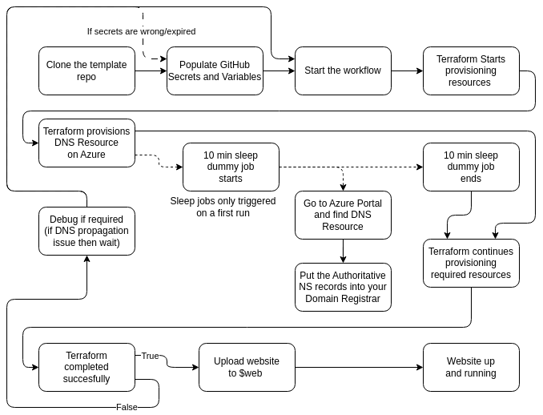
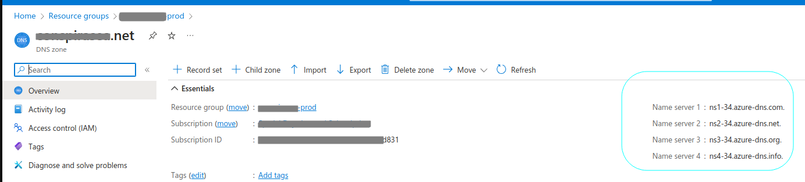
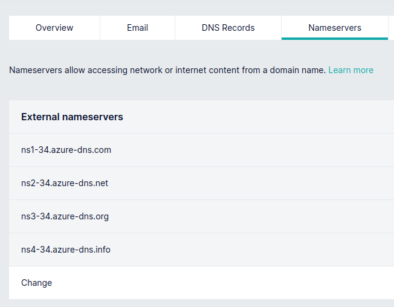
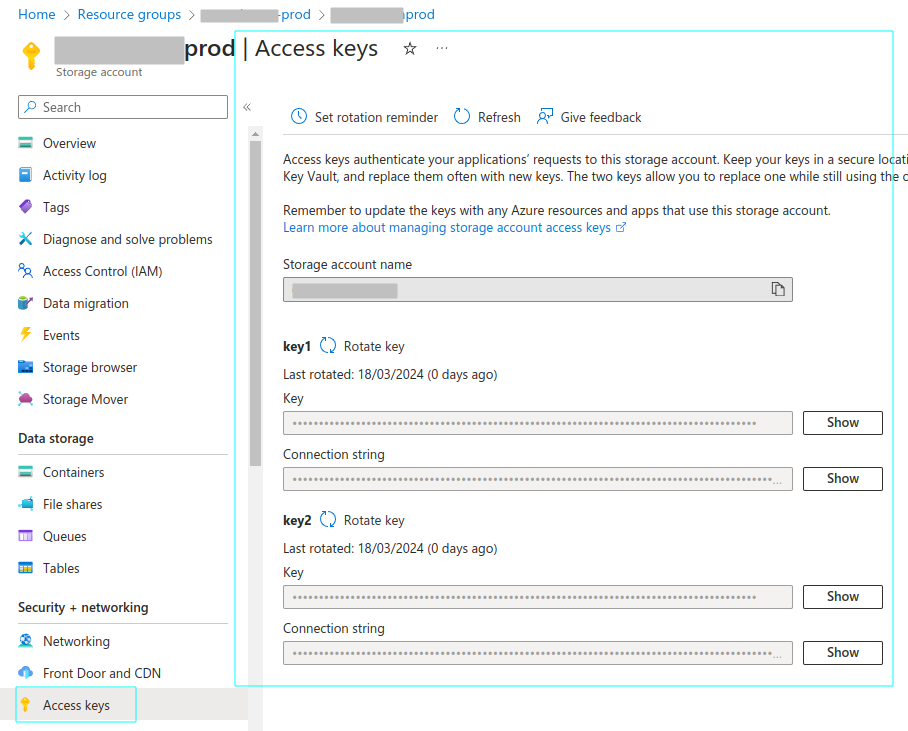

# Azure-CDN-Static-Website-Terraform-Template

Terraform deployment for static website hosting on Azure using Azure Blob Storage and Azure CDN with a custom domain and self-managed SSL certificate from Let's Encrypt.

## What does it do

This Terraform deployment creates the Azure Storage Account on the cloud and together with other various resources it serves the webpage from the Azure Blob Storage. It also creates the Azure CDN and the custom domain and self-managed SSL certificate from Let's Encrypt. In `home_page.tf` you can see the rewrite rules that are used to redirect the HTTP traffic to HTTPS and also to treat the page as a single-page application.

## Required Secrets and Variables

This action requires the following secrets and variables to be set in the GitHub repository settings. Bear in mind that you are using repository managed environments, you can uncomment the `environment` key in the workflow file and set the environment name there which will be used for the secrets and variables below.

### Secrets

Setup your secrets in the GitHub repository settings. You will need the following secrets:

| Environment variable for Terraform | GitHub Secret Name                               |
| ---------------------------------- | ------------------------------------------------ |
| TF_VAR_SUBSCRIPTION_ID             | ${{ secrets.TF_VAR_SUBSCRIPTION_ID }}            |
| TF_VAR_CLIENT_ID                   | ${{ secrets.TF_VAR_CLIENT_ID }}                  |
| TF_VAR_CLIENT_SECRET               | ${{ secrets.TF_VAR_CLIENT_SECRET }}              |
| TF_VAR_TENANT_ID                   | ${{ secrets.TF_VAR_TENANT_ID }}                  |
| TF_VAR_STATE_RESOURCE_GROUP_NAME   | ${{ secrets.TF_VAR_STATE_RESOURCE_GROUP_NAME }}  |
| TF_VAR_STATE_STORAGE_ACCOUNT_NAME  | ${{ secrets.TF_VAR_STATE_STORAGE_ACCOUNT_NAME }} |
| TF_VAR_STATE_CONTAINER_NAME        | ${{ secrets.TF_VAR_STATE_CONTAINER_NAME }}       |

### Environment Variables

Setup your environment variables in the GitHub repository settings. You will need the following environment variables:

| Environment variable for Terraform | Github Variable Name                   |
| ---------------------------------- | -------------------------------------- |
| TF_VAR_ENVIRONMENT                 | ${{ vars.TF_VAR_ENVIRONMENT }}         |
| TF_VAR_PROJECT_COMMON_NAME         | ${{ vars.TF_VAR_PROJECT_COMMON_NAME }} |
| TF_VAR_DOMAIN_NAME                 | ${{ vars.TF_VAR_DOMAIN_NAME }}         |
| TF_VAR_LETSENCRYPT_EMAIL           | ${{ vars.TF_VAR_LETSENCRYPT_EMAIL }}   |
| TF_VAR_AZURE_REGION                | ${{ vars.TF_VAR_AZURE_REGION }}        |

## How to use it

Run the Terraform actions which will make your resources. While that is creating, wait for the Azure DNS to be created and then put the nameservers from the DNS resource into your domain registrar as an NS record. If you are using the root of the domain, set your nameservers to the ones from the Azure DNS resource. If you are using a subdomain, set your NS record for the required subdomain to the ones from the Azure DNS resource. Dummy sleep for 10 minutes job is set up after creating the Azure DNS resource to give you time to set the NS records on your domain registrar and for it to propagate.

After the Azure DNS is created, you can check the nameservers in the online dashboard and set them in your domain registrar.

In case your DNS is slow propagating, your Terraform will probably fail because it will not be able to create the SSL certificate. In that case, you can just re-run the terraform and it will continue from where it left off.

At this point, your terraform should make the certificates and deploy your website successfully. Now you need to upload your static website to the Azure Blob Storage. You can do that by using the Azure Storage Explorer or by using the Azure CLI. Make sure you upload to a container called `$web` and that your index page is named to whatever you set in `home_page.tf`. You can find the secrets for the Azure Storage Account in the Azure Portal.

## Notes

- Terraform Apply action is set to run on a schedule in the GitHub Actions in order to refresh the SSL certificate when it is about to expire (45 days before expiration).
- The SSL certificate is created using the Let's Encrypt service and the Terraform script uses the acme provider to create the certificate by entering various DNS records where and when necessary. The certificate is created using the DNS challenge and the Azure DNS service. Because limited set of dns providers is supported by acme terraform provider, we had to delegate the domain to Azure DNS which can be managed by acme provider.
